# cloud_disk

> 云盘项目: https://github.com/Cui7Shark/cloud_disk
>
> 笔记作者: 七海big_shark (鹏)

## 1. 项目总体架构

首先搭建fastdfs分布式文件服务器集群，再利用ngnix反向代理服务器，接收并处理用户的请求，其中还使用了FastCGI+spawn-fcgi配合nginx工作；
然后还用到了MySQL和Redis数据库，其中MySQL用于存储文件的信息，Redis呢主要用于存储用户注册登录之类的鉴权信息。


主要工作流程是用户通过浏览器（或者客户端）发送操作请求到web服务器，也就是由nginx反向代理的web服务器。然后fastCGI+spawn-fcgi模块创建进程来接收通过web服务器而来的用户请求，并交由fastDFS文件系统处理，并返回处理后的结果给web服务器，web服务器再将结果展示给用户。
————————————————


- Qt制作云盘客户端 （实现文件上传、下载、删除、分享功能）

  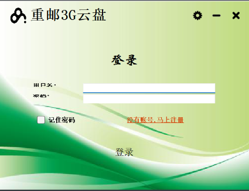

- 服务端：
  - **nginx**作为代理服务器，转发客户端请求给后台FastCGI进行处理
  - **FastCGI**对Nginx转发过来的请求进行解析处理。
  - **FastDFS**集群中storage节点保存着客户端的文件。
  - **Redis**保存着客户端的信息（token）等。
  - **MySQL**保存着用户、文件的信息。

- **项目包含的技术大概有：**
  - Qt客户端的编写。
  - Nginx的配置（配置FastCGI模块、配置FastDFS模块）。
  - FsatCGI的使用。
  - FastDFS的使用。
  - Redis、MySQL的使用。
  - HTTP接口的使用。
  - JSON协议解析。

------


## 2. Nginx技术

- 俄罗斯人开发
- C语言编写
- 开源

1. 用途
   1. 做web服务器
   2. 反向代理服务器
   3. 邮件服务

2. 特性
   - 可实现负载均衡、缓存、访问控制、带宽控制等功能
   - 可并发处理百万级的TCP连接
   - 高扩展，模块化
   - 可以热部署 ，master和worker的分离设计，可实现7*24小时不间断服务的前提下升级nginx可执行文件。
   - 最自由 - BSD开源协议
   - 更快
   - 可靠
   - 低内存消耗

3. 源码安装

   - 下载Nginx源码包

   - 所需的三个库

     - PCRE库：Nginx的HTTP模块使用它来解析正则表达式
     - zlib ：对HTTP数据包做gzip格式的压缩，以减少网络传输量
     - openssl库 ：支持SSL协议， 安全传输HTTP， MD5使用需要

   - 编译安装：

     - 解压

     ```shell
     #软件版本需要注意，不一致可能会安装失败
     tar xzf nginx-1.10.1.tar.gz
     tar xzf openssl-1.0.1t.tar.gz
     tar xjf pcre-8.40.tar.bz2
     tar xzf zlib-1.2.11.tar.gz
     ```

     - 进入相应源码包 (先装三个库，再装Nginx)

     ```shell
     #Nginx
     ./configure --prefix=/usr/local/nginx --with-http_realip_module --with-http_addition_module --with-http_gzip_static_module --with-http_secure_link_module --with-http_stub_status_module --with-stream --with-pcre=/home/build/pcre-8.40 --with-zlib=/home/build/zlib-1.2.11 --with-openssl=/home/build/openssl-1.0.1t
     
     make
     
     sudo make install
     
     #一般有Makefile 直接make make install
     #没有就 ./configure 后 在make
     
     ```

     - 文件位置

     ```shell
     #Nginx会安装在
     /usr/local/ 
     #配置文件 配置文件能够决定Nginx及其模块的工作方式
     /usr/local/nginx/conf/nginx.conf
     #二进制程序
     /usr/local/nginx/sbin/nginx
     #日志 （报错时需要看error.log）
     /usr/local/nginx/logs
     #网页
     /usr/local/nginx/html
     ```

   - ### 第三方模块的安装步骤

     - ①定位你想要使用的模块
     - ②下载该模块
     - ③解压缩源代码安装包。
     - ④如果有README文件，那么阅读README文件， 查看在安装中是否有依赖安装
     - ⑤通过下面的命令选项配置使用该模块

     ```shell
     ./configure -add-module=<path>
     ```

   - ### Linux内核参数的优化

     - **需要修改Linux内核参数，使得Nginx可以拥有更高的性能**
     - **需要修改/etc/sysctl.conf来更改内核参数**

- ### Nginx相关命令

```shell
#启动
sudo /usr/local/nginx/sbin/nginx 
#创建软连接
sudo ln -s /usr/local/nginx/sbin/nginx  /usr/bin/nginx
#关闭
sudo nginx -s stop
#软关闭 (完成任务后退出)
sudo nginx -s quit
#重启 （修改了nginx.conf后需要）
sudo nginx -s reload
#测试配置信息是否有错误
sudo nginx -t
#查看进程
ps aux | grep nginx
```

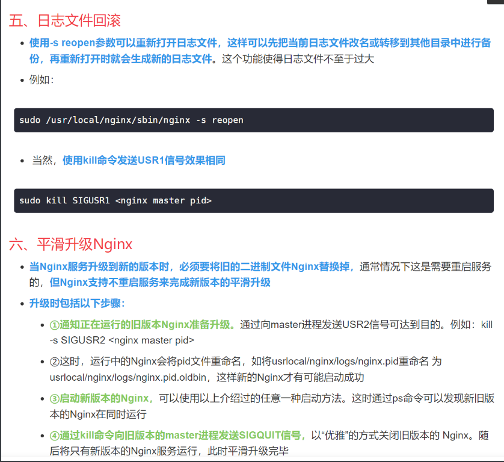

- 配置文件 nginx.conf

```shell

#user  nobody;
worker_processes  1;

#error_log  logs/error.log;
#error_log  logs/error.log  notice;
#error_log  logs/error.log  info;

#pid        logs/nginx.pid;


events {
    worker_connections  1024;
}


http {
    include       mime.types;
    default_type  application/octet-stream;

    #log_format  main  '$remote_addr - $remote_user [$time_local] "$request" '
    #                  '$status $body_bytes_sent "$http_referer" '
    #                  '"$http_user_agent" "$http_x_forwarded_for"';

    #access_log  logs/access.log  main;

    sendfile        on;
    #tcp_nopush     on;

    #keepalive_timeout  0;
    keepalive_timeout  65;


    #gzip  on;

    # 一个server节点对应一台服务器
    server {
        listen       80;
        server_name  localhost;     # 域名

        #charset koi8-r;

        #access_log  logs/host.access.log  main;
        
        # 设置接收的最大文件大小
        client_max_body_size   50m;
        location /login{
            fastcgi_pass 127.0.0.1:10000;
            include fastcgi.conf;
        }
        
        location /reg{
            fastcgi_pass 127.0.0.1:10001;
            include fastcgi.conf;
        }

        location /upload{
            fastcgi_pass 127.0.0.1:10002;
            include fastcgi.conf;
        }

        location /md5{
            fastcgi_pass 127.0.0.1:10003;
            include fastcgi.conf;
        }

        location /myfiles{
            fastcgi_pass 127.0.0.1:10004;
            include fastcgi.conf;
        }

        location /dealfile{
            fastcgi_pass 127.0.0.1:10005;
            include fastcgi.conf;
        }

        location /sharefiles{
            fastcgi_pass 127.0.0.1:10006;
            include fastcgi.conf;
        }
        
        location /dealsharefile{
            fastcgi_pass 127.0.0.1:10007;
            include fastcgi.conf;
        }

        # 配置ngxin fastdfs模块
        location /group1/M00{
            root /home/fastdfs/storage/store_data/data;
            ngx_fastdfs_module;
        }

        #error_page  404              /404.html;

        # redirect server error pages to the static page /50x.html
        #
        error_page   500 502 503 504  /50x.html;
        location = /50x.html {
            root   html;
        }

    }

}
```

- ### 反向代理

  - 反向代理方式是指代理原始服务器来**接受来自Internet的链接请求**，然后将**请求转发给内部网络上的原始**

    **服务器，并将从原始服务器上得到的结果转发给Internet上请求数据的客户端**。那么顾名思义，**反向代理**

    **就是位于Internet和原始服务器之间的服务器**，对于客户端来说就表现为一台服务器，客户端所发送的请

    求都是直接发送给反向代理服务器，然后由反向代理服务器统一调配。

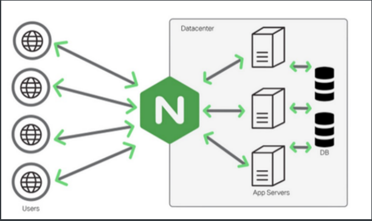

- 以代理服务器来接受Internet上的连接请求。
- 将请求转发给内部网络上的服务器。
- 将服务器上得到的结果返回给Internet上连接的客户端。
- 反向代理服务器是为web服务器服务的。

- ### 域名绑定IP

​		一个域名只能绑定一个IP

​		一个IP地址被多个域名绑定

- ### **反向代理和负载均衡**

  - 反向代理设置

    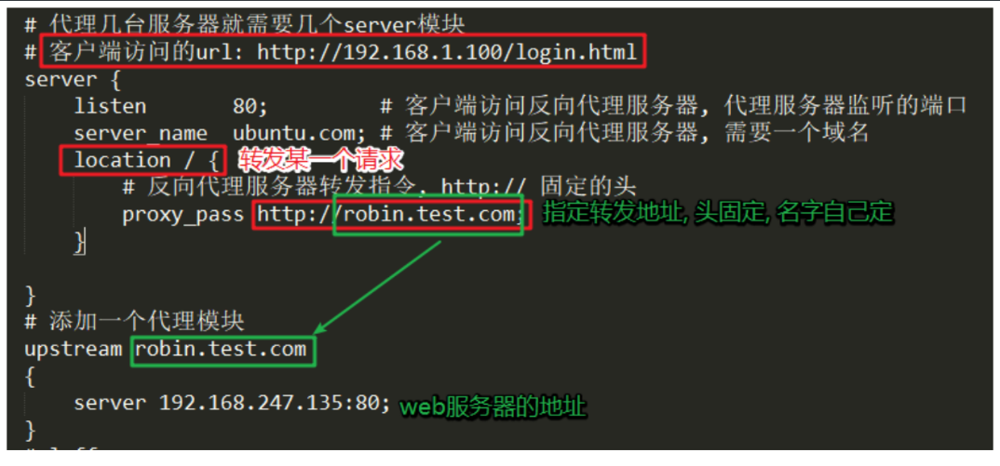

  - 负载均衡设置

    - **负载均衡其意思就是分摊到多个操作单元上进行执行** ，不让后面的个别的服务器太累。
    - **使用轮询的方式**
    - **分配权重 weight**    指定轮询几率，weight和访问比率成正比，用于后端服务器性能不均的情况

    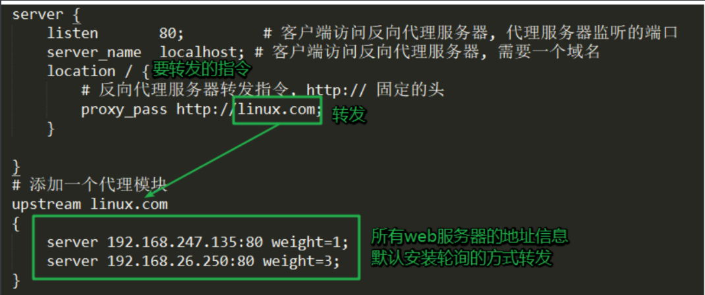


------


## 3.CGI技术

- CGI ： **通用网关接口**（**C**ommon **G**ateway **I**nterface/**CGI**）**描述了客户端和服务器程序之间传输数据的一种标准**，

- CGI处理流程：
  - 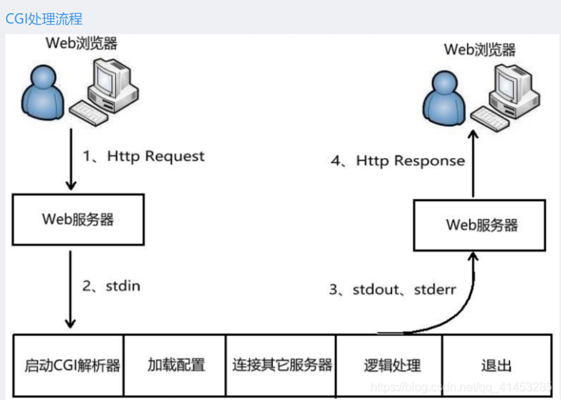

>1.客户端向服务器发送请求，通过url
>
>2.服务器接收数据并解析
>
>3.nginx不知怎么处理的请求发送给cgi程序 ，创建cgi进程
>
>4.cgi进程执行：CGI 进程启动***\*解析器、加载配置(如业务相关配置)、连接其它服务器(如数据库服务器)、 逻辑处理等\****
>
>5.CGI 进程将处理结果***\*通过标准输出、标准错误，传递给 web 服务器\****
>
>6.服务器将cgi处理结果发送给客户端，杀死cgi进程

- 弊端

  - 在服务器端CGI进程会被频繁的创建销毁

  - 服务器开销大, 效率低

- CGI使用场景

  - 牛客网，网页客户端将数据当做输入传递给后端的cgi程序，cgi程序处理完成之后将结果作为输出返回给客户端

    

  - **cgi与server进程的区别：**cgi使用输入输出与客户端进行交互，但是server使用的是http等协议与客户端进行交互

  

### 1. fastcgi

- CGI 使外部程序与 Web 服务器之间交互成为可能，但效率低。
- FastCGI 致力于减少 Web 服务器 与 CGI 程式之间互动的开销，从而使服务器可以同时处理更多的 Web 请求。与为每个请求 创建一个新的进程不同，FastCGI 使用持续的进程来处理一连串的请求。**这些进程由 FastCGI 进程管理器管理**（例如下面我们要介绍的spawn-fcgi），而不是 web 服务器。

- cgi 和 fastcgi区别

  > 1. cgi是短生存周期的应用程序，fastcgi 是长生存周期的应用程序，可以一直执行，不用每次都去fork();
  >
  > 2. fastcgi不需要不停的产生新进程，可大大降低服务器压力
  >
  > 总之：cgi 是一个请求对一个进程，FasiCGI就是在后端申请一个进程池，请求来了之后从进程池中取进程，而不用每次创建销毁

  

  ------

  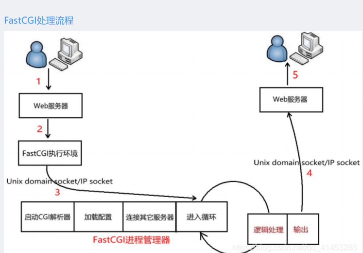

- fastcgi处理流程

  >1. 客户端发送给服务器请求
  >2. nginx服务器解析请求，发现不会处理转发给fastcgi 通过socket方式
  >3. fastcgi 可以通过ip网络通信或者socket本地套接字两种方式启动，进程管理器初始化，启动多个cgi进程
  >4. FastCGI 主进程选择并连接到一个 CGI 解释器。Web 服务器***\*将 CGI 环境变量和标准输入发送到 FastCGI 子进程\****
  >5. FastCGI 子进程处理好了，将结果从同一个socket返回服务器，关闭连接
  >6. 子进程等待下一个连接（阻塞状态）

- 安装

  - 

### 2. ngx_http_fastcgi_module模块

> fastcgi进程由FastCGI进程管理器管理，而不是nginx。这样就需要一个FastCGI管理，管理我们编写fastcgi程序。我们使用spawn-fcgi作为FastCGI进程管理器。

- nginx上安装这个模块，通过fastcgi协议将客户端请求转发给spawn-fcgi处理
- 工作原理
  Web浏览器通过HTTP请求将数据发送给Nginx，但是Nginx的数据都是HTTP格式的，那么FastCGI如何处理这些数据呢？
  此时ngx_http_fastcgi_module模块会将Nginx的HTTP协议转换为fastcgi协议，然后将数据转发给FastCGI程序进行处理

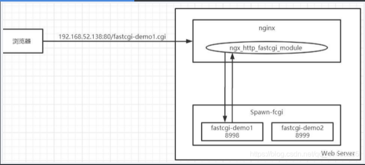

- 在nginx.conf中配置

  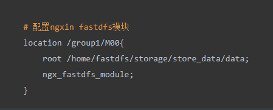

- nginx如何进行数据转发

  - 1. 请求的url` http://localhost/login?user=zhang3&passwd=123456&age=12&sex=man `转换为一个指令

    - 去掉协议
    - 去掉IP和端口
    - 去掉文件名
    - 去掉？ 和后面的字符串
    - 留下的/login 是 服务器要处理的指令

    2. 转发给fastcgi 

       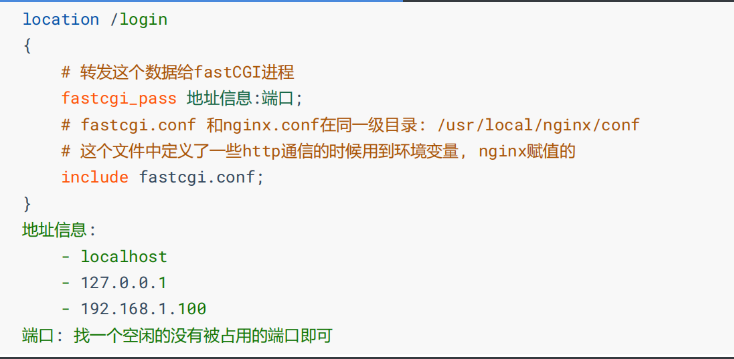

### 3.fastcgi通信协议

- 二进制连续传递
- 定义统一结构消息，用来读取每个消息的消息体，方便切割
- 类型

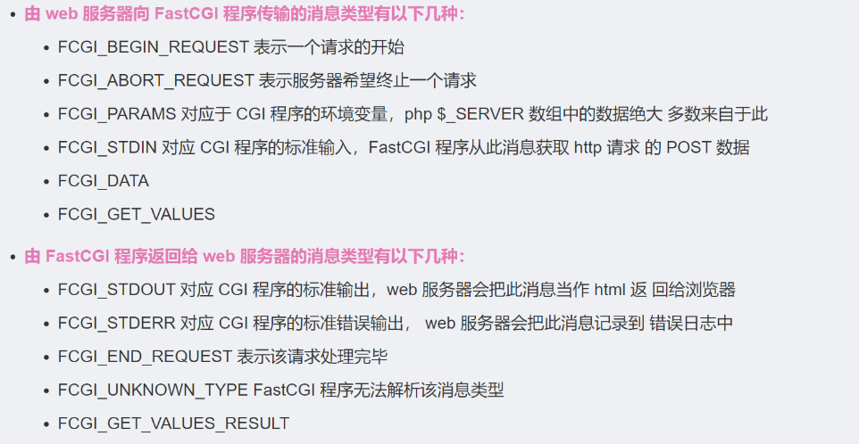

- 传递过程

  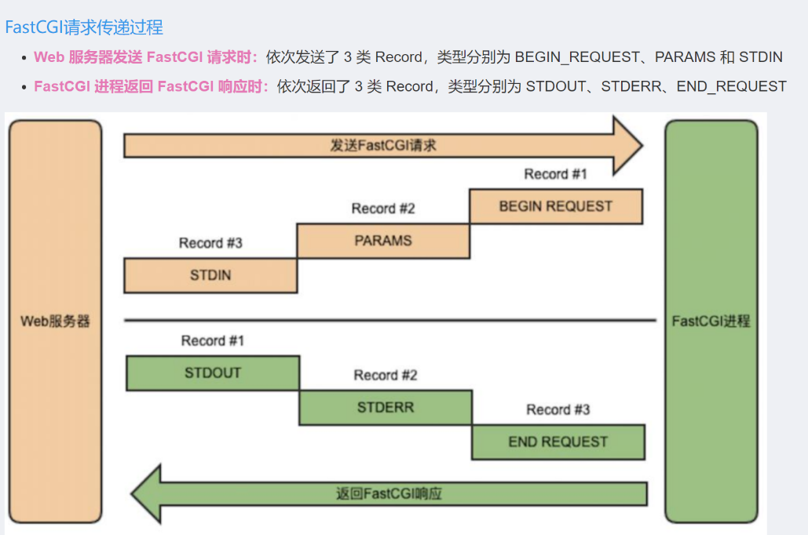

- 数据包格式
  - 头部+包体
  - header 8 字节
  - body 8的整数倍

### 4. spawn-fcgi (进程管理器)

> 由于FastCGI进程由FastCGI进程管理器管理，而不是Nginx。这样就**需要一个 FastCGI 进程管理器，管理我们编写 FastCGI 程序**

- **spawn-fcgi 使用 pre-fork 模型，**功能主要是打开监听端口，绑定地址，然后 fork-and-exec 创建我们编写的 FastCGI 应用程序进程，退出完成工作。FastCGI 应用程序初始化，然后进入死循环侦听 socket 的连接请求

- ### FastCGI 协议、spawn-fcgi、Nginx 三者关系

  - NGINX -> web服务器 ，http协议输入输出

  - spawn-fcgi -> fastcgi协议的输入输出

  - 直接由Nginx将HTTP协议转换为Fastcgi协议传输给fastCGI进程处理

    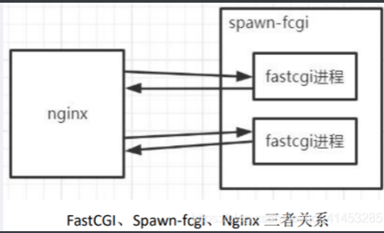

- 安装

  ```shell
  
  tar zxf spawn-fcgi-1.6.4.tar.gz
  cd
  ./configure
  make
  sudo make install
  # **？启动！
  spawn-fcgi -a 0.0.0.0 -p 8000 -f ./echo
  #参考https://dongshao.blog.csdn.net/article/details/106321820
  ```

  - 安装完成之后，spawn-fcgi程序被安装在了/usr/local/bin/目录下

- 编程演示
  - 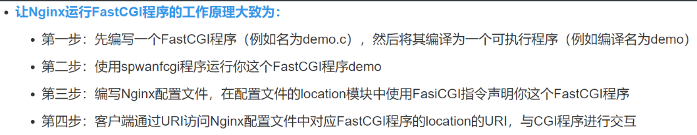

- 参考https://dongshao.blog.csdn.net/article/details/106321820

- ### 修改Nginx配置文件

  - `sudo vim /usr/local/nginx/conf/nginx.conf`
  - 

------


## 4.FastDFS技术

### 1. 介绍

- yuqing开发的 c语言， 开源， 分布式系统
- 用来搭建文件服务器集群提供文件上传、下载等功能

- 三个角色
  - 追踪器 – tracker
  - 存储节点 – storage
  - 客户端 – client

- fastDFS三个角色之间的关系

  > Client和Storage主动连接Tracker
  > Storage主动向Tracker报告其状态信息
  > 磁盘剩余空间
  > 文件同步状况
  > 文件上传下载次数
  > Storage会启动一个单独的线程来完成对一台Tracker的连接和定时报告
  > 一个组包含的Storage不是通过配置文件设定的，而是通过Tracker获取到的

- ## 分布式文件系统

  - 文件系统的全部任务不在同一台主机上，在很多台主机上多个分散的文件系统组合在一起，形成了一个完整的文件系统
  - 🥚不放在一个篮子里

### 2.安装

- 先装libfastcommon库，用来操作dfs

  


### 3. FastDFS集群搭建

```shell
#1.第一步（复制配置文件）
fastdfs的默认配置文件存放在/etc/fdfs/目录下
ls /etc/fdfs
 
sudo cp /etc/fdfs/tracker.conf.sample /etc/fdfs/tracker.conf
 
sudo cp /etc/fdfs/storage.conf.sample /etc/fdfs/storage.conf
 
sudo cp /etc/fdfs/client.conf.sample /etc/fdfs/client.conf
 
ls /etc/fdfs

#2.第二步（配置启动tracker端）
自己在/home下创建个fastdfs目录
mkdir tracker
修改/etc/fdfs/目录下的trakcer.conf配置文件，用来启动tracker端。
sudo vim /etc/fdfs/tracker.conf
改：base_path : tracker节点信息
启动tracker服务端，并查看是否启动成功：
sudo fdfs_trackerd /etc/fdfs/tracker.conf
netstat -aptn | grep 22122

#3.第三步（配置启动storage端）
在fastdfs目录下创建一个storage目录，用来存放与storage端的信息
mkdir  storage 
修改/etc/fdfs/目录下的storage.conf配置文件，用来启动tracker端。
sudo vim /etc/fdfs/storage.conf
```

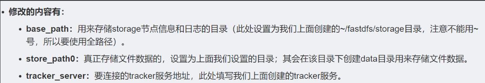

```shell
启动storage节点，并查看是否启动成功：
sudo fdfs_storaged /etc/fdfs/storage.conf
 
# 过10秒左右再查看（因为storage需要创建很多目录）
netstat -aptn | grep 23000

#4第四步（修改客户端配置文件）
在fastdfs目录下创建一个client目录，用来存放与client端的信息（此处的client就是我们的FastCGI后台服务进程）
修改/etc/fdfs/目录下的client.conf文件
sudo vim /etc/fdfs/client.conf

```


```shell
检测集群状态
fdfs_monitor /etc/fdfs/client.conf
```

###  4. 添加FastDFS相关的配置文件

- 将fastdfds-nginx-module模块源码包中的**src目录下的mod_fastdfs.conf文件拷贝一份到/etc/fdfs目录下。**

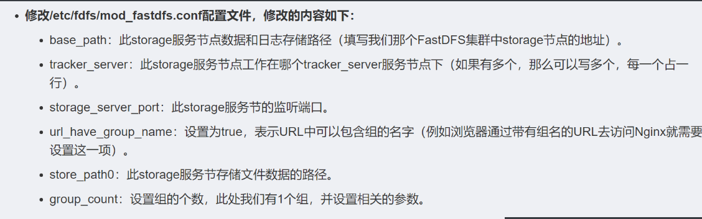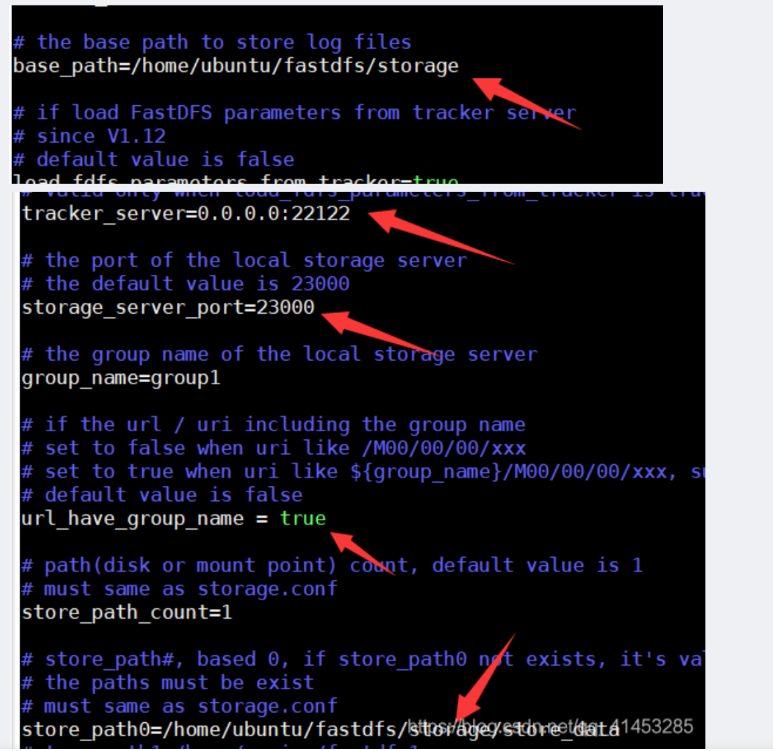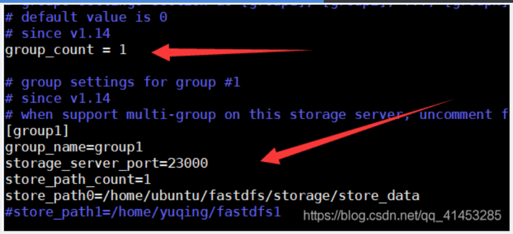

- **将fastdfs源码目录conf/目录下的http.conf、mime.types**也复制到/etc/fdfs/目录下。

- ### 修改Nginx配置文件

  - 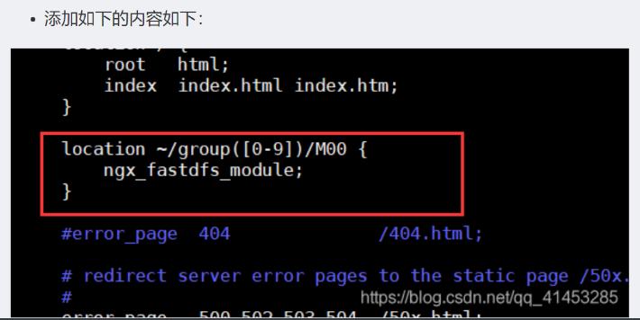

## 5.Redis

- Redis 是完全开源免费的，遵守BSD协议，是一个高性能的key-value数据库。

- Redis支持数据的持久化，可以将内存中的数据保存在磁盘中，重启的时候可以再次加载进行使用。
- Redis不仅仅支持简单的key-value类型的数据，同时还提供list，set，zset，hash等数据结构的存储。
- Redis支持数据的备份，即master-slave模式的数据备份。

- 优点

  > **性能极高** – Redis能读的速度是110000次/s,写的速度是81000次/s 。
  > 丰富的数据类型 – Redis支持二进制案例的 Strings, Lists, Hashes, Sets 及 Ordered Sets 数据类型操作。
  > 原子 – Redis的所有操作都是原子性的，意思就是要么成功执行要么失败完全不执行。单个操作是原子性的。多个操作也支持事务，即原子性，通过MULTI和EXEC指令包起来。
  > 丰富的特性 – Redis还支持 publish/subscribe, 通知, key 过期等等特性。

- 关系型数据库和非关系型数据库
  - 数据库一般分为关系型数据库和非关系型数据库，Redis是非关系型数据库；

- 安装

  - hiredis - 用于提供操作redis的API, 要安装

    参看https://blog.csdn.net/qq_41453285/article/details/106355155


## 6. MySQL

- 存储文件，用户信息

- 安装：https://blog.csdn.net/weixin_44816732/article/details/104173717 ， bilibili - 尚硅谷MySQL课程高级篇

- 开启ssh, navicatpremium 连接MySQL，

- 建表-执行脚本 source ./cloud_disk

  ```shell
  DROP database IF EXISTS `cloud_disk`;
  CREATE DATABASE `cloud_disk`;
  
  use `cloud_disk`;
  
  
  DROP TABLE IF EXISTS `file_info`;
  CREATE TABLE `file_info` (
    `id` bigint(20) NOT NULL AUTO_INCREMENT COMMENT '文件序号，自动递增，主键',
    `md5` varchar(256) NOT NULL COMMENT '文件md5',
    `file_id` varchar(256) NOT NULL COMMENT '文件id:/group1/M00/00/00/xxx.png',
    `url` varchar(512) NOT NULL COMMENT '文件url 192.168.52.139:80/group1/M00/00/00/xxx.png',
    `size` bigint(20) DEFAULT '0' COMMENT '文件大小, 以字节为单位',
    `type` varchar(32) DEFAULT '' COMMENT '文件类型： png, zip, mp4……',
    `count` int(11) DEFAULT '0' COMMENT '文件引用计数,默认为1。每增加一个用户拥有此文件，此计数器+1',
    PRIMARY KEY (`id`)
  ) ENGINE=InnoDB AUTO_INCREMENT=70 DEFAULT CHARSET=utf8 COMMENT='文件信息表';
  
  
  DROP TABLE IF EXISTS `share_file_list`;
  CREATE TABLE `share_file_list` (
    `id` int(11) NOT NULL AUTO_INCREMENT COMMENT '编号',
    `user` varchar(32) NOT NULL COMMENT '文件所属用户',
    `md5` varchar(256) NOT NULL COMMENT '文件md5',
    `file_name` varchar(128) DEFAULT NULL COMMENT '文件名字',
    `pv` int(11) DEFAULT '1' COMMENT '文件下载量，默认值为1，下载一次加1',
    `create_time` timestamp NULL DEFAULT CURRENT_TIMESTAMP COMMENT '文件共享时间',
    PRIMARY KEY (`id`)
  ) ENGINE=InnoDB AUTO_INCREMENT=16 DEFAULT CHARSET=utf8 COMMENT='共享文件列表';
  
  
  DROP TABLE IF EXISTS `user_file_count`;
  CREATE TABLE `user_file_count` (
    `id` int(11) NOT NULL AUTO_INCREMENT,
    `user` varchar(128) NOT NULL COMMENT '文件所属用户',
    `count` int(11) DEFAULT NULL COMMENT '拥有文件的数量',
    PRIMARY KEY (`id`),
    UNIQUE KEY `user_UNIQUE` (`user`)
  ) ENGINE=InnoDB AUTO_INCREMENT=5 DEFAULT CHARSET=utf8 COMMENT='用户文件数量表';
  
  
  DROP TABLE IF EXISTS `user_file_list`;
  CREATE TABLE `user_file_list` (
    `id` int(11) NOT NULL AUTO_INCREMENT COMMENT '编号',
    `user` varchar(32) NOT NULL COMMENT '文件所属用户',
    `md5` varchar(256) NOT NULL COMMENT '文件md5',
    `create_time` timestamp NULL DEFAULT CURRENT_TIMESTAMP COMMENT '文件创建时间',
    `file_name` varchar(128) DEFAULT NULL COMMENT '文件名字',
    `shared_status` int(11) DEFAULT NULL COMMENT '共享状态, 0为没有共享， 1为共享',
    `pv` int(11) DEFAULT NULL COMMENT '文件下载量，默认值为0，下载一次加1',
    PRIMARY KEY (`id`)
  ) ENGINE=InnoDB AUTO_INCREMENT=30 DEFAULT CHARSET=utf8 COMMENT='用户文件列表';
  
  
  DROP TABLE IF EXISTS `user_info`;
  CREATE TABLE `user_info` (
    `id` bigint(20) NOT NULL AUTO_INCREMENT COMMENT '用户序号，自动递增，主键',
    `user_name` varchar(32) NOT NULL DEFAULT '' COMMENT '用户名称',
    `nick_name` varchar(32) CHARACTER SET utf8mb4 NOT NULL DEFAULT '' COMMENT '用户昵称',
    `password` varchar(32) NOT NULL DEFAULT '' COMMENT '密码',
    `phone` varchar(16) NOT NULL DEFAULT '' COMMENT '手机号码',
    `email` varchar(64) DEFAULT '' COMMENT '邮箱',
    `create_time` timestamp NULL DEFAULT CURRENT_TIMESTAMP COMMENT '时间',
    PRIMARY KEY (`id`),
    UNIQUE KEY `uq_nick_name` (`nick_name`),
    UNIQUE KEY `uq_user_name` (`user_name`)
  ) ENGINE=InnoDB AUTO_INCREMENT=14 DEFAULT CHARSET=utf8 COMMENT='用户信息表';
  
  ```

  

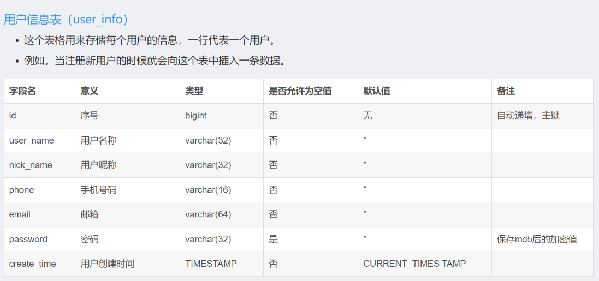

------


## 7. 功能阐述

### 1.文件上传的代码流程

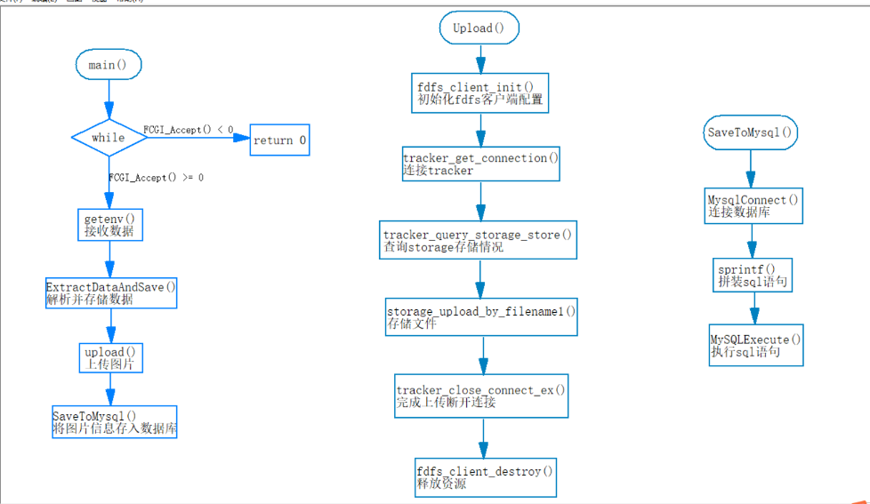 

------


### 2. 注册功能的实现

#### 业务流程：

- Qt客户端发送HTTP请求给Nginx， Nginx接收到请求后将请求转发给FastCGI， FastCGI通过自己的一些内置的环境变量获取到URL和报文主体进行解析。分析数据，提取数据，MySQL保存用户注册信息。服务器回复json格式响应报文。
- 客户端发送的HTTP请求字段：
  - URL 
  - 请求方式：POST
  - HTTP版本：1.1
  - Content-Type : application/json
- 请求主体：
  - 用户名
  - 密码
  - 昵称
  - 手机号
  - 邮箱
- HTTP响应报文主体：code 结果值 002成功 003用户存在 004失败

#### QT客户端代码解析 -- 注册流程

1. 用户输入信息 抽取输入数据QString类型
2. 进行数据校验,判读输入的格式是否正确, 使用QRegExp类
3. 调用setRegisterJson()函数将输入转换为JSON格式 (作为请求报文主体)
   - 里面使用了QMap数据类型,形成K-V键值对. `QMap<QString, QVariant>`
   - 然后将QMap类型转换为QJsonDocument类  调用`QJsonDocument::fromVariant()` 类成员函数.
4. 开始构造连接服务器的URL和请求报文 `QString url` ; 将报文头和主体发送出去 `QNetworkRequset request`  , `request.seturl(QUrl(url));`
5. 等待服务器回传的消息 JSON格式, 解析code字符串,做判断.

```c++
//----QT端---
// 用户注册操作
void Login::on_register_btn_clicked()
{
    // 从控件中取出用户输入的数据 QString类型
    QString userName = ui->reg_usr->text();
    QString nickName = ui->reg_nickname->text();
    QString firstPwd = ui->reg_pwd->text();
    QString surePwd = ui->reg_surepwd->text();
    QString phone = ui->reg_phone->text();
    QString email = ui->reg_mail->text();


    // 数据校验
    QRegExp regexp(USER_REG);
    if(!regexp.exactMatch(userName))
    {
        QMessageBox::warning(this, "警告", "用户名格式不正确");
        ui->reg_usr->clear();
        ui->reg_usr->setFocus();
        return;
    }
    if(!regexp.exactMatch(nickName))
    {
        QMessageBox::warning(this, "警告", "昵称格式不正确");
        ui->reg_nickname->clear();
        ui->reg_nickname->setFocus();
        return;
    }
    regexp.setPattern(PASSWD_REG);
    if(!regexp.exactMatch(firstPwd))
    {
        QMessageBox::warning(this, "警告", "密码格式不正确");
        ui->reg_pwd->clear();
        ui->reg_pwd->setFocus();
        return;
    }
    if(surePwd != firstPwd)
    {
        QMessageBox::warning(this, "警告", "两次输入的密码不匹配, 请重新输入");
        ui->reg_surepwd->clear();
        ui->reg_surepwd->setFocus();
        return;
    }
    regexp.setPattern(PHONE_REG);
    if(!regexp.exactMatch(phone))
    {
        QMessageBox::warning(this, "警告", "手机号码格式不正确");
        ui->reg_phone->clear();
        ui->reg_phone->setFocus();
        return;
    }
    regexp.setPattern(EMAIL_REG);
    if(!regexp.exactMatch(email))
    {
        QMessageBox::warning(this, "警告", "邮箱码格式不正确");
        ui->reg_mail->clear();
        ui->reg_mail->setFocus();
        return;
    }

    // 将注册信息打包为json格式
    QByteArray array = setRegisterJson(userName, nickName, m_cm.getStrMd5(firstPwd), phone, email);
    qDebug() << "register json data" << array;
    // 设置连接服务器要发送的url
    QNetworkRequest request;
    QString url = QString("http://%1:%2/reg").arg(ui->address_server->text()).arg(ui->port_server->text());

    qDebug() << "url:" << url;

    request.setUrl(QUrl(url));
    // 设置请求头
    request.setHeader(QNetworkRequest::ContentTypeHeader, QVariant("application/json"));
    request.setHeader(QNetworkRequest::ContentLengthHeader, QVariant(array.size()));
    // 发送数据
    QNetworkReply* reply = m_manager->post(request, array);

    // 判断请求是否被成功处理
    connect(reply, &QNetworkReply::readyRead, [=]()
    {
        // 读sever回写的数据
        QByteArray jsonData = reply->readAll();
        /*
        注册 - server端返回的json格式数据：
            成功:         {"code":"002"}
            该用户已存在：  {"code":"003"}
            失败:         {"code":"004"}
        */
        // 判断状态码
        if("002" == m_cm.getCode(jsonData))
        {
            //注册成功
            QMessageBox::information(this, "注册成功", "注册成功，请登录");

            //清空行编辑内容
            ui->reg_usr->clear();
            ui->reg_nickname->clear();
            ui->reg_pwd->clear();
            ui->reg_surepwd->clear();
            ui->reg_phone->clear();
            ui->reg_mail->clear();

            //设置登陆窗口的登陆信息
            ui->log_usr->setText(userName);
            ui->log_pwd->setText(firstPwd);
            ui->rember_pwd->setChecked(true);

            //切换到登录界面
            ui->stackedWidget->setCurrentWidget(ui->login_page);
        }
        else if("003" == m_cm.getCode(jsonData))
        {
            QMessageBox::warning(this, "注册失败", QString("[%1]该用户已经存在!!!").arg(userName));
        }
        else if("004" == m_cm.getCode(jsonData))
        {
            QMessageBox::warning(this, "注册失败", "注册失败！！！");
        }
        // 释放资源
        delete reply;
    });
}
```

#### 服务器端代码解析 -- 注册流程

1. 服务器端: Nginx + fastCGI处理
2. 在Nginx配置文件中设置注册/reg的转发端口10001, 请求会转发给FastCGI. (fcgi.sh 脚本中会设置端口 对应 ./bin_cgi/register 程序的地址) 
3. **查看reg_cgi.c的main函数**
   1. 使用“CONTENT_LENGTH”环境变量获取请求报文主体. 若为空就报错
   2. 若请求报文有内容, 就调用fread()从Nginx中读取HTTP请求报文的所有内容(从输入缓冲读取I/O函数缓冲 or 套接字缓冲,buf)，然后调用user_register()函数在服务端注册该用户。
   3. 获取MySQL数据库的IP,端口
   4. `get_reg_info()` : 调用JSON的C API提取JSON数据, 获取用户名等信息.
   5. 连接MySQL
   6. 若用户不存在, 构造SQL语句, 将用户数据插入到`user_info` 表中.
   7. 若注册成功, 构造字符串out , 然后将字符串构造为JSON格式 
   8. out返回给Nginx. Nginx返回给客户端

> 用户密码加密 -- MD5加密 
>
> MD5: 信息-摘要算法 5 , 确保信息传输完整一致. 又叫哈希算法.
>
> MD5 不可逆, 本意用来校验数据的完整性, 用于明文密码加密
>
> 在Nginx中安装了 openssl 插件 用于进行MD5加密

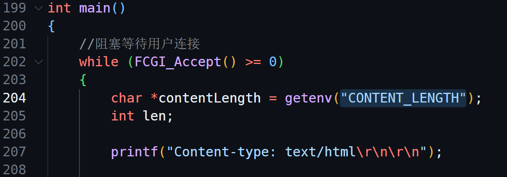

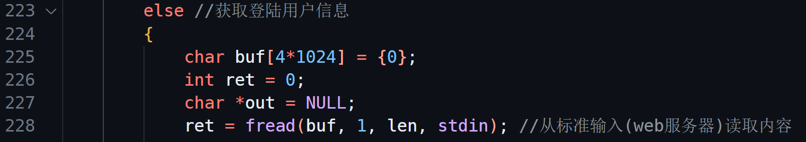

------

###  3.登录功能的实现

登录的时候会发送3个URL请求报文给服务器端

- /login URL ： 判断用户账号和密码是否正确
- /myfile？cmd=count URL : 登录成功后，Qt客户端再发送一个请求获得自己的文件数量
- /myfile？cmd=normal：获取文件

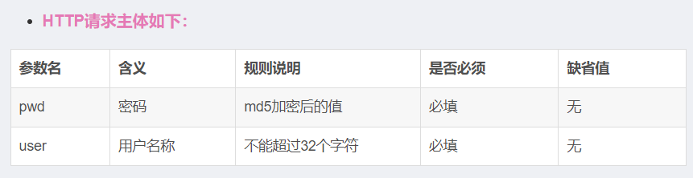

服务器会给客户端发送HTTP响应报文：


- 服务器生成token令牌，存在Redis，还发给客户端，以后客户端再发送请求时，就在报文主体里只加上token，和用户名，这样服务器可以和自己保存的token比较。不用每次都去验证各种信息，节省HTTP传输资源。

#### 登录业务流程：

- Qt客户端通过发送一个HTTP请求给Nginx（URL以login结尾），Nginx接收到这个请求将请求传递给FastCGI，FastCGI通过自己一些内置的环境变量获取到URL和报文主体进行解析。


#### Qt客户端代码解析

1. 从文本框中获取用户名、密码、服务器端地址
2. 判断用户信息的格式是否正确
3. 把登录信息加密，设置URL 发送给服务器端
4. 等待服务器响应，code ：000 成功，
5. 获取用户文件列表 会调用refreshFiles()函数
6. refreshFiles()函数构造一个/myfiles?cmd=count URL给服务端，来获得自己在服务端拥有的文件数量
7. 获得自己的文件数量之后，调用getUserFilesList()函数获得文件的所有内容

#### 服务器端代码解析

1. 服务器接收到登录和获取文件的请求URL后，会调用两个FastCGI （在Nginx配置文件里用location 声明），在启动FastCGI时会在脚本里设置端口转到的cgi程序。
2. 没有请求就阻塞，通过`CONTENT_LENGTH` 环境变量来获取HTTP请求主体是否有内容，有内容才进一步分析。
3. 调用fread（）从Nginx读取读取数据，从标准输入(web服务器)读取内容, 读取的就是用户的登录信息。调用get_login_info()函数获取登录用户的用户名和密码。再调用check_user_pwd() 从MySQL判断这个用户的相关信息是否正确。
4. 如果登录信息正确。调用set_token()给这个客户端随机生成一个token保存在redis中，然后调用return_login_status()给前端返回数据。
5. 当服务器发现客户端发来的URL以myfiles结尾，会调用myfiles_cgi.c程序，处理文件。

>token验证：
>
>token：令牌， 本质是HTTP session，是用户自定义的任意字符串，只有客户端和服务器知道，成为两者之间的密钥，让服务器确认对方身份。
>
>流程：
>
>1. 客户端首次登录
>2. 服务器验证用户名和密码
>3. 成功后，服务器生成token，可以存储在内存、磁盘、数据库，把token发给客户端
>4. 客户端收到token存起来，放在cookie，本地存储
>5. 客户端每次向服务端请求时，在报文主体加入token
>6. 服务器收到请求，去验证token。
>
>Base64 ：
>
>它是一种用64个字符来表示任意二进制数据的方法，常用在URL、Cookie、网页中传输少量二进制数据。
>
>Base64要求把每三个8bit的字节转换成四个6bit的字节（4*6 = 24）再把6bit的高位添2个0，组成四个8bit的字节。
>
>

### 4. 上传文件

HTTP请求字段：

- URL：http://xxx.xxx.xxx.xxx/upload
- 请求方式：POST
- HTTP版本：1.1
- Content-Type ：application/octet-stream

HTTP请求主体：

| 参数名 | 含义 |     规则      |
| :----: | ---- | :-----------: |
| token  | 密码 | md5加密后的值 |

HTTP响应报文主体：

| 参数 |  含义  |            规则            |
| :--: | :----: | :------------------------: |
| code | 结果集 | 008 ：上传失败   009：成功 |

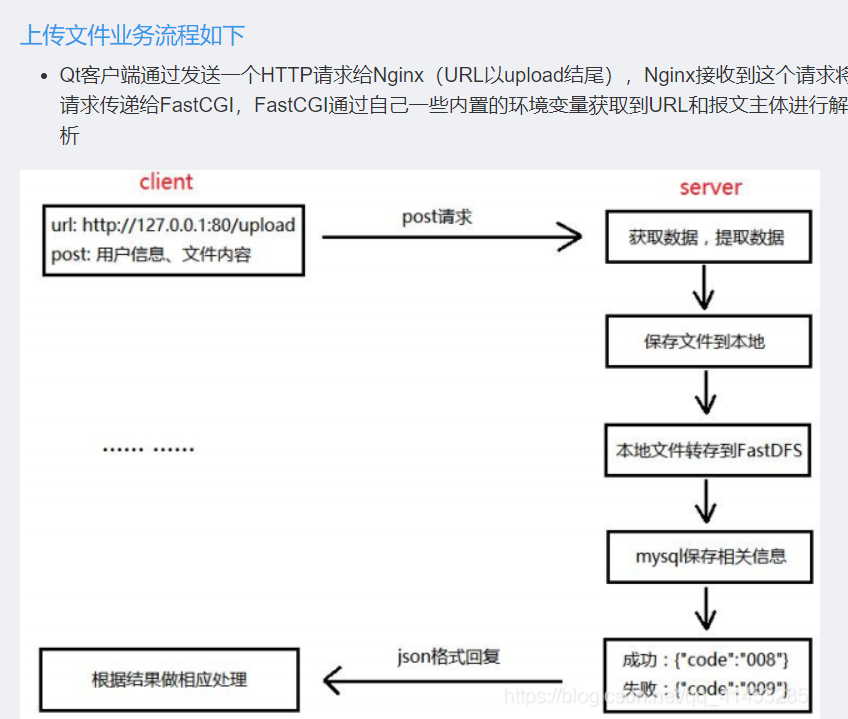
